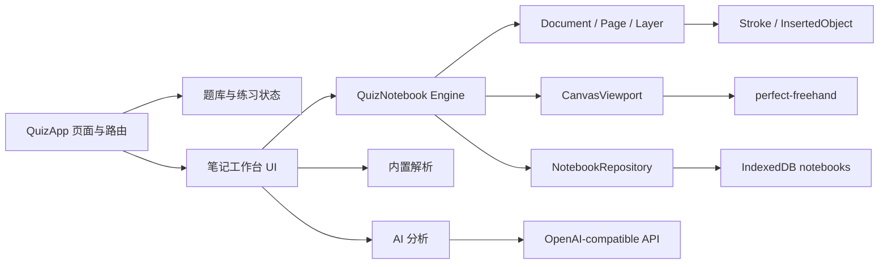

# SpeedyNote 派生笔记架构

> 历史方案说明：本文记录旧 HTML/WebView 阶段的 JavaScript 派生实现。2026-07-16 起，正式路线已调整为 Qt 6.9.3 + C++17 原生客户端，并直接适配固定版本的 SpeedyNote 原生核心。当前实施以 [综合学习平台实施计划](综合学习平台实施计划.md) 和 `native/third_party/speedynote/UPSTREAM.md` 为准，本文不再作为目标架构。

## 决策摘要

- 目标：在不推翻 QuizApp 题库、AI、APK、EXE 和 Release 链路的前提下，提供题目绑定笔记与自由笔记。
- 用户：手机刷题用户、平板手写用户、桌面复习用户。
- 路径：选择题目或笔记本 -> 书写/插入对象 -> 查看内置解析或 AI 分析 -> 保存并恢复。
- 数据：题库来自内置 JSON、用户导入和 Release；笔记与 AI 分析保存在本机；API Key 只保存在设备。
- 技术：现有 HTML/JavaScript、Android WebView、C# 本地 HTTP 外壳保持不变；新增 SpeedyNote 派生引擎和 IndexedDB Repository。
- 约束：兼容旧笔迹和覆盖安装；平板触控笔优先；大型图片题库不能反复序列化；派生代码遵守 GPL-3.0。
- 本阶段不做：不把 Qt/C++ 二进制嵌入 WebView；不宣称支持 `.snb/.snbx`、OCR 或原生 360Hz 输入；不上传用户笔记。PDF 导入使用独立的 PDF.js 离线渲染链路。

## 运行时边界



`index.html` 负责路由、题库上下文、UI 组合和 AI 调用。`notebook/speedynote-notebook.js` 只负责笔记数据、编辑命令、命中测试、视口和渲染，不读取题库，也不保存 API Key。

## 源码映射

| QuizApp 模块 | SpeedyNote 源码依据 | 当前移植范围 |
| --- | --- | --- |
| 文档创建与规范化 | `source/core/Document.*` | 文档标识、分页/无限模式字段、当前页、最后视口 |
| 页面管理 | `source/core/Page.*` | 页面、背景、图层、对象、活动图层 |
| 图层管理 | `source/layers/VectorLayer.h` | 可见、锁定、透明度、排序、删除后的对象亲和关系 |
| 笔画与命中测试 | `source/strokes/VectorStroke.h`, `StrokePoint.h` | 压感点、包围盒、整笔擦除、JSON 数据 |
| 插入对象 | `source/objects/InsertedObject.*` | 文本、图片、题目对象、位置、尺寸、层级、锁定 |
| 画布视口 | `source/core/DocumentViewport.*` | 页面坐标、缩放中心、平移、绘制、选择和移动 |
| 触摸手势 | `source/core/TouchGestureHandler.*` | 防误触、单指平移、双指平移与缩放 |

上游参考版本固定为 `6b2bbc15127b0a8a8c046e7f4168a598c976ee3b`。后续同步上游时必须更新映射、第三方声明和回归测试，不能只替换界面。

## 数据模型

```text
NotebookDocument
  id, title, kind(question|free), binding, mode, activePageId
  pages[]
    NotebookPage
      id, width, height, background, activeLayerId
      layers[]
        VectorLayer
          id, name, visible, locked, opacity
          strokes[]
            id, tool, color, size, pointerType, points[], bounds
      objects[]
        id, type, x, y, width, height, rotation
        zOrder, layerAffinity, visible, locked, data
  bookmarks[]
    id, pageId, label, note, createdAt
```

题目笔记的 `binding.questionKey` 使用 QuizApp 既有题目唯一键。自由笔记的 `binding` 为 `null`。两者使用同一格式，后续可以增加题目笔记转自由笔记、跨题链接，不再创建第二套手写存储。

## 持久化和迁移

IndexedDB 数据库 `quizapp_study_data` 升级到版本 4：

- `large_banks`：大型题库正文。
- `ink_notes`：旧版单页笔迹和完成标记，继续保留用于兼容。
- `notebooks`：新文档模型。
- `notebook_assets`：PDF 页面等大型笔记底图资源，按 `documentId` 建索引。

打开题目时先按稳定题目键查找 `notebooks`。不存在时读取旧 `ink_notes`，把 0-1 归一化坐标转换成 1200 x 1600 页面坐标，再写入新仓库。迁移不删除旧记录。新完成标记同时回写旧记录，保证“继续未练题目”兼容旧逻辑。

## 交互规则

1. 手写笔使用钢笔或荧光笔；开启防误触时，单指不产生笔迹。
2. 单指触摸或手形工具平移画布；双指以手势中心缩放并同步平移。
3. 橡皮先按包围盒预筛选，再计算点到线段距离，删除完整笔画。
4. 选择工具先命中上层对象，再从上层图层向下命中笔画；空白区拖动会框选多个对象/笔画，支持合并移动、复制粘贴、副本和组删除。
5. 视口变换不写入撤销栈；笔画、对象、背景、页面和图层变更写入撤销栈。
6. 编辑后防抖保存；手动保存、切题和退出会立即保存。
7. 页面条绘制笔迹与对象缩略图，支持拖动排序；视口跨手机/平板尺寸或横竖屏变化时重新适配纸张，同尺寸设备仍恢复上次缩放位置。

## 后续路线

### 对象编辑

- 选框八方向缩放和套索整组缩放/旋转（当前已实现单对象缩放旋转、框选多选和复制粘贴）。
- 图层拖动排序、合并和复制（当前已实现重命名、透明度和按钮排序）。
- 页面纸张模板管理（当前已实现缩略图预览、拖动排序、复制和删除确认）。
- 笔画局部擦除、套索变换和跨页面移动。

### 学习资料

- 已完成 PDF.js 离线导入、页码范围选择、逐页批注、页面缩略图和 PDF 原文搜索；渲染底图与笔记文档分离保存。
- 已完成带批注整本 PDF 导出、页面书签和 Android 系统另存为；PDF 页面替换仍可继续完善。
- 已完成笔记标签以及题目、其他笔记和 HTTPS 外部资料的结构化关联，并实现 Markdown、KaTeX 公式对象和 Cytoscape.js 图谱视图。
- 已完成笔记标题、文本/Markdown/公式对象、题目绑定、书签、标签、链接和 PDF 原文的本地全文索引；后续增加跨科目标签筛选面板。
- 可选 OCR；原图与原笔迹始终保留为权威数据。

### 学习闭环

- 模拟考试、限时、草稿纸、错因标签和复习队列。
- 闪卡、间隔复习、知识点图谱和学习统计。
- AI 相似题、错因归纳和笔记摘要；所有生成内容明确标记为 AI。

### 同步和协作

- 先实现完整本地备份包和恢复事务，再设计服务端同步。
- 用户选择同步范围；API Key 默认不同步。
- 冲突按文档/页面版本解决，不用“最后上传覆盖全部”。
- 公告、版本、题库和笔记同步使用独立资源版本。

## 验收矩阵

| 场景 | 必测内容 |
| --- | --- |
| 平板横屏 | 手写笔、手掌触摸、双指缩放、三栏不遮挡、对象拖动 |
| 手机竖屏 | 左右抽屉、画布尺寸、系统返回、保存和恢复 |
| 桌面 | 鼠标书写、滚轮缩放、对象选择、EXE 静态资源 |
| 题目笔记 | 当前题绑定、切题保存、内置解析、AI 分析、返回刷题 |
| 自由笔记 | 新建、打开、分页、图层、删除、刷新恢复 |
| PDF 笔记 | 文件选择、页码范围、底图清晰度、笔迹叠加、文本搜索、整本批注导出、资源删除和完整备份 |
| 富文本和图谱 | Markdown 安全预览、KaTeX 公式、对象再编辑、书签、图谱搜索/跳转和手机全屏布局 |
| 数据迁移 | 旧笔迹数量和坐标、完成状态、重复打开不重复迁移 |
| 构建 | APK/EXE 包含 `notebook/`、`vendor/`、PDF.js worker、题库和许可声明 |
