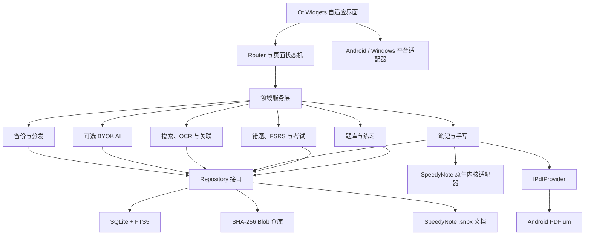

# Project013 原生学习平台全面优化与重构计划

## 1. 计划目的

本计划不是继续向现有单文件页面堆功能，而是把 QuizApp 重构为一个本机优先、Android 平板优先、可在 Windows 复用的原生学习平台。

最终产品仍以题库为中心，但每个主要模块都必须达到可以独立成为一个应用的完成度。所谓完成，不是有入口或弹窗，而是具备完整模型、完整流程、异常处理、持久化、导入导出、设置、性能预算、自动化测试、设备验收和使用文档。

已确认的边界：

1. 客户端使用 Qt 6.9.3 + C++17 重构，第一优先级为 Android 平板，随后交付 Windows。
2. SpeedyNote v1.5.0 的固定上游提交作为真实原生手写核心，停止扩张当前 JavaScript Canvas 仿制实现。
3. 旧 HTML/WebView 版只保留迁移和应急兼容，不再承担长期新功能开发。
4. 不做账号、服务器和云同步；离线状态下所有核心功能必须完整可用。
5. `.quizbackup` 必须能够在设备之间迁移全部学习数据，默认排除 API Key、OCR 模型和临时缓存。
6. 题库内置解析、用户答案、用户笔记、人工错因和 AI 输出必须物理分开、界面分区、独立导出。
7. 所有刷题和练习界面都能进入当前题目的手写模式，返回后恢复练习模式、题号、答案、进度和视口位置。

## 2. 当前项目扫描基线

扫描日期：2026-07-16。

### 2.1 代码与数据

| 项目 | 当前结果 | 判断 |
| --- | ---: | --- |
| Web 主程序 | `index.html` 11,617 行，536,273 字节 | 已超过适合持续维护的单文件规模 |
| 全局命名函数 | 622 个 | 状态、渲染和业务逻辑高度耦合 |
| 内联点击事件 | 231 处 | 路由、权限和模态行为难以统一 |
| 整块 `innerHTML` 重绘 | 46 处 | 大题库切题、保存和局部操作容易卡顿及丢视口 |
| 内置题库 | 27 个 JSON，2,551 道题 | 已具备真实数据规模，必须做质量审计和稳定 ID |
| 运行形态 | 浏览器单文件、Android WebView、C# 本地服务 EXE | 三端共享旧页面，但平台能力被壳层补丁分散处理 |
| 原生重构 | Qt Core/Sql/Test 静态核心已建立 | 只有底座，没有原生应用 UI 和完整 Repository |
| SpeedyNote | v1.5.0、提交 `dd538636...` 已固定引入 | 上游源码已在仓库，真实适配器尚未完成 |

### 2.2 当前验证结果

- 17 项 Web 回归中 14 项通过。
- AI 学习、考试历史和学习统计 3 项被首次公告模态层遮挡，点击超时。根因是公告、路由和业务模态没有统一协调，不能只修改测试绕过。
- PDF 笔记索引竞态已经修复，相关回归通过。
- SQLite Schema 和 `.quizbackup v2` JSON Schema 校验通过。
- Qt 原生核心已经分别在 Android arm64 和 Windows MinGW 13.1 编译；Windows 原生核心 Qt Test 为 1/1 通过。
- 当前 Qt 6.9.3 Android 安装不包含 `QtPdf`。Android PDF 必须通过 Provider 接口接入 PDFium，不能再声称 `QPdfDocument` 可直接解决 Android PDF。

### 2.3 当前视觉与交互结论

1. 首页已经有清晰的绿色主题和基本信息层级，但平板仍主要是放大的移动布局，空间利用率和模块优先级不足。
2. 刷题页的核心操作可见，但顶栏操作、底部导航和题卡状态仍由页面级重绘控制，容易出现操作后视角跳动。
3. 当前手写页表面上有题目栏、画布、工具栏和解析栏，但工具密度过高，纸张在平板中仅占固定区域，缩放、平移和对象编辑不具备专业笔记应用的自由度。
4. 设置页配置项很多，但仍是长表单思路，缺少搜索、依赖关系、即时预览、重置范围和变更摘要。
5. 公告、更新、题库下载、备份和业务弹窗没有统一模态队列，已经形成实际功能阻断。

## 3. 独立应用级完成标准

每个模块只有同时满足以下 12 项，才能标记为“完成”：

1. **领域模型**：数据结构、状态和边界明确，不依赖 UI 文本或数组下标。
2. **核心闭环**：创建、打开、使用、保存、恢复、重命名、删除和导出均可完成。
3. **异常闭环**：空数据、损坏数据、低存储、权限撤销、网络失败和进程中断有明确结果。
4. **导航闭环**：应用返回、系统返回、手势返回、深层返回和进程恢复一致。
5. **设置闭环**：合理默认值、即时预览、保存提示、撤销或恢复默认值齐全。
6. **数据闭环**：数据有唯一所有者、版本迁移、事务、校验、备份和恢复。
7. **跨端闭环**：手机竖屏、平板横屏、鼠标、触摸和触控笔分别验收。
8. **性能闭环**：有明确预算、基准数据和退化测试，不以“主观感觉流畅”为结论。
9. **可访问性**：触控区、对比度、字体缩放、键盘焦点、读屏标签和减少动画可用。
10. **隐私安全**：敏感数据安全存储，外部内容隔离，导出前明确告知范围。
11. **测试闭环**：领域单元测试、Repository 测试、UI 流程测试和真机证据齐全。
12. **文档闭环**：用户说明、数据格式、迁移规则、开源来源和已知限制同步更新。

## 4. 评判维度与质量门槛

评分采用 0 到 5：0 表示不存在，1 表示演示级，2 表示可用但脆弱，3 表示常规可用，4 表示稳定完整，5 表示具备独立产品质量。

| 维度 | 当前估计 | 目标 | 进入稳定版的硬门槛 |
| --- | ---: | ---: | --- |
| 1. 产品信息架构 | 2 | 5 | 一级入口不超过 5 个；所有功能有唯一归属；无重复入口 |
| 2. 功能闭环 | 2 | 5 | 每个正式功能通过上述 12 项完成标准 |
| 3. 架构与可维护性 | 1 | 5 | UI、领域、Repository、平台适配器无反向依赖 |
| 4. 导航与状态恢复 | 2 | 5 | 100% 路由通过系统返回、旋转和进程恢复用例 |
| 5. 刷题引擎 | 3 | 5 | 六种学习入口共享稳定题目状态，不共享错误会话状态 |
| 6. 手写输入质量 | 1 | 5 | 压感、手掌排斥、历史触点、侧键和橡皮端有真机证据 |
| 7. 画布视口与对象编辑 | 1 | 5 | 锚点缩放、惯性平移、回弹、套索、旋转和跨页移动完整 |
| 8. 手机/平板自适应 | 2 | 5 | 独立布局规则，不使用等比放大手机界面代替平板设计 |
| 9. 性能与资源占用 | 2 | 5 | 2,000 题切换、300 页 PDF、30 分钟书写均满足预算 |
| 10. 题库质量 | 2 | 5 | 全库 Schema、题型、答案、重复、图片和解析审计无 P0/P1 |
| 11. 数据一致性 | 2 | 5 | SQLite 为唯一权威状态；更新、迁移、回滚均使用事务 |
| 12. 学习科学 | 2 | 5 | 练习、错因、FSRS、考试和统计形成可解释学习闭环 |
| 13. 备份与跨设备迁移 | 3 | 5 | 2 GB 备份往返、校验失败、空间不足和中断恢复均通过 |
| 14. 可靠性与可观测性 | 2 | 5 | 无空 `catch`；日志含模块、操作和错误码；崩溃可恢复 |
| 15. 安全与隐私 | 2 | 5 | Key 进入系统安全存储；AI、题库和用户数据物理隔离 |
| 16. 无障碍与输入兼容 | 1 | 4 | WCAG AA、48dp 触控区、字体缩放、键盘和读屏主流程通过 |
| 17. 发布与内容分发 | 3 | 5 | 应用、公告、题库三套 Manifest 独立校验和失败回退 |
| 18. 测试与发布证据 | 2 | 5 | CI 统一输出单元、迁移、性能、截图、设备和安装报告 |

## 5. 目标架构



### 5.1 分层规则

- `ui/`：页面、组件、设计令牌、响应式布局，只消费 ViewModel。
- `routing/`：路由栈、模态队列、深层链接、系统返回和状态快照。
- `domain/`：题目、会话、复习卡、考试、笔记、统计等纯模型。
- `services/`：业务规则和事务边界，不访问 QWidget。
- `repositories/`：SQLite、Blob、笔记文档、设置的唯一读写入口。
- `handwriting/`：SpeedyNote 上游适配器，不让业务层 include 上游 UI 头文件。
- `platform/`：文件选择器、下载、安装、KeyStore、通知、分享和窗口能力。
- `migration/`：旧 WebView localStorage/IndexedDB 到原生数据库的一次性迁移。

### 5.2 核心数据规则

- 题目使用稳定 UUIDv5。可信来源使用 `provider + sourceId`，无来源题使用规范化路径、题干和选项生成身份。
- 内容哈希和身份分离。题库内容更新时身份不随非关键文本变化，用户进度和笔记可迁移。
- SQLite 保存结构化状态和可检索元数据。
- 图片、PDF 和附件按 SHA-256 存储，避免 Base64 重复进入题库和快照。
- SpeedyNote 文档单独保存为 `.snbx`，数据库只保存索引和题目关联。
- AI Key 使用 Android Keystore / Windows Credential Manager，不进入主数据库和默认备份。
- `.quizbackup v2` 为 ZIP 容器，含 Manifest、SQLite 快照、笔记和 Blob 校验清单；恢复验证完成前不触碰当前数据。

## 6. 功能模块与开源参考

开源项目分为三种采用方式：`复用`表示引入代码并遵守协议；`适配`表示通过接口接入其核心；`参考`表示只学习交互与领域语义，不复制代码。

| 模块 | 独立应用级目标 | 开源参考 | 采用方式 |
| --- | --- | --- | --- |
| 应用壳与自适应导航 | 手机、平板、Windows 独立布局；统一路由与模态队列 | [KDE Kirigami](https://github.com/KDE/kirigami)、[Android Compose Samples](https://github.com/android/compose-samples) | 参考响应式导航和窗口尺寸分类 |
| 题库目录与编辑 | 任意层级、拖动、回收站、批量导入、健康报告 | [Moodle](https://github.com/moodle/moodle) | 参考题库、类别和导入语义 |
| 题库格式与迁移 | 版本 Schema、稳定 ID、覆盖迁移、隔离坏题 | Moodle XML/QTI 语义、[Anki](https://github.com/ankitects/anki) | 参考成熟题目和包格式；保持 QuizApp 契约 |
| 顺序/随机练习 | 秒开、快速切题、选项可改、独立/合并进度可配置 | [AnkiDroid](https://github.com/ankidroid/Anki-Android) | 参考会话恢复、快捷操作和离线状态 |
| 背题与答案表 | 上次位置、筛选、定位、批量浏览和导出 | AnkiDroid、Moodle question bank | 参考浏览器与题目预览流程 |
| 题号总览 | 按题型分组、虚拟化、答对/错误/未答状态和快速定位 | Moodle quiz navigation | 参考 attempt navigation 语义 |
| 错题集与收藏 | 用户主动加入、独立于重置、标签、备注、删除和恢复 | AnkiDroid tagged cards | 参考集合、标签和状态迁移 |
| FSRS 复习 | 忘记/困难/良好/简单、可解释到期队列和历史 | [fsrs-rs](https://github.com/open-spaced-repetition/fsrs-rs)、AnkiDroid | 复用调度算法，UI 与数据归 QuizApp |
| 模拟考试 | 组卷、计时、暂停、交卷、成绩、历史和错题回顾 | Moodle Quiz | 参考 attempt、grading 和 review 语义 |
| 学习统计 | 本地计时、周/月/三月趋势、科目与题型分布 | [ActivityWatch](https://github.com/ActivityWatch/activitywatch)、[Chart.js](https://github.com/chartjs/Chart.js) | 参考本地事件聚合；图表按需复用 |
| 手写文档内核 | 分页/无限画布、图层、笔画、对象、撤销和增量保存 | [SpeedyNote](https://github.com/alpha-liu-01/SpeedyNote) | 固定提交适配，遵守 GPL-3.0 |
| 手写移动交互 | 触控笔优先、工具抽屉、深色纸张、目录和快捷动作 | [Saber](https://github.com/saber-notes/saber) | 参考，不复制 Flutter UI |
| 画布缩放与移动 | 锚点缩放、双指手势、惯性、回弹和适配页面 | SpeedyNote、[Butterfly](https://github.com/LinwoodCloud/Butterfly) | SpeedyNote 适配；AGPL 项目只参考 |
| 套索与对象编辑 | 框选、移动、缩放、旋转、组合、锁定和对齐 | [Excalidraw](https://github.com/excalidraw/excalidraw) | 参考 MIT 项目的对象交互模型 |
| PDF 阅读与批注 | 页缩略图、搜索、书签、批注、导出和大文档缓存 | [Xournal++](https://github.com/xournalpp/xournalpp)、[PDFium](https://pdfium.googlesource.com/pdfium/) | 参考页面模型；Android 通过 Provider 接入 PDFium |
| OCR | 本地打印文字识别、区域选择、进度、取消和可编辑结果 | [Tesseract](https://github.com/tesseract-ocr/tesseract) | 可选模型下载，不塞入基础 APK |
| Markdown 与公式 | 可编辑源、离线渲染、搜索和 PDF 导出 | [marked](https://github.com/markedjs/marked)、[KaTeX](https://github.com/KaTeX/KaTeX) | 迁移现有能力或使用原生等价渲染器 |
| 搜索与知识关联 | FTS5、标签、题目/笔记/PDF 关联和可过滤图谱 | [Logseq](https://github.com/logseq/logseq)、[Cytoscape.js](https://github.com/cytoscape/cytoscape.js) | 图谱交互参考；AGPL 源码不复制 |
| AI 配置与辅导 | DeepSeek 预设、兼容 API、模型能力、上下文和来源标记 | [LibreChat](https://github.com/danny-avila/LibreChat) | 参考 BYOK/provider 配置和会话语义 |
| 备份恢复 | 流式打包、哈希、预览、回滚、跨设备恢复 | [restic](https://github.com/restic/restic)、[minizip-ng](https://github.com/zlib-ng/minizip-ng) | 参考内容寻址；复用轻量 ZIP 实现 |
| 应用与题库更新 | GitHub Release 检查、进度、校验、安装和失败回退 | [Obtainium](https://github.com/ImranR98/Obtainium) | 参考 Release 解析和 Android 安装流程 |
| 安全存储 | API Key 不落普通设置，不进默认备份 | [QtKeychain](https://github.com/frankosterfeld/qtkeychain) | 适配 Android Keystore 和 Windows 凭据管理器 |
| 图标与主题 | 语义色、浅深色、动态色、统一图标和减少动画 | [Material Design Icons](https://github.com/Templarian/MaterialDesign) | 固定版本复用 Apache-2.0 图标 |
| Android 流程测试 | 返回、旋转、权限、文件、覆盖安装和低内存恢复 | [Maestro](https://github.com/mobile-dev-inc/Maestro) | 复用流程自动化工具 |

所有依赖在引入前必须完成协议、版本、体积、维护状态、离线可用性和 Android ABI 审查。MuPDF 的 AGPL 后端不得静默进入默认构建；Butterfly、Logseq 等 AGPL 项目仅作交互参考。

## 7. 刷题与学习闭环重做

### 7.1 统一题目状态，分离会话状态

- `Question` 只保存题库事实。
- `AnswerState` 保存用户当前选择和历史修订。
- `PracticeSession` 保存范围、模式、顺序、当前位置和视口。
- `PracticeProgress` 保存手动或自动提交的持久进度。
- `WrongBookEntry`、`ReviewCard`、`UserNote`、`AIRecord` 分别独立。
- 顺序和随机默认分开保存，但可以通过设置选择共享 AnswerState；随机只改变顺序，不复制题目。

### 7.2 切题和保存性能

- 竖向模式只保留当前题附近的窗口，不渲染 2,000 张完整题卡。
- 横向模式只复用前、当前、后三张页面；连续点击时更新目标队列，不等待上一段动画结束。
- 题号总览按题型分组并虚拟化，打开时才计算统计标签。
- 选择选项、看答案、错题操作只更新当前卡片局部状态，禁止整页重绘和强制滚动。
- 保存使用增量事务和后台队列，不序列化完整题库；UI 只展示明确的“已保存/保存失败”。

### 7.3 导航恢复

进入手写前保存：

```text
route, bankId, scopeId, mode, questionId, visibleIndex,
answerDraft, progressRevision, scrollAnchor, horizontalOffset
```

返回时先恢复题目和会话，再恢复视口锚点。不能通过重新打开题库或重新随机生成顺序来模拟返回。

## 8. SpeedyNote 原生手写重做

### 8.1 不再保留的实现方式

- 不继续把 `canvas` 事件、题目 UI、工具栏和文档存储写在同一个 JavaScript 模块。
- 不使用固定纸张缩放加外层滚动容器模拟自由画布。
- 不让单指触摸、双指手势和触控笔共享同一套模糊判断。
- 不把 SpeedyNote 的巨大 `MainWindow` 整体嵌入 QuizApp。

### 8.2 真实适配范围

从固定上游提交建立 QuizApp Adapter，优先接入：

1. `Document`、`Page` 和文档序列化。
2. `VectorLayer`、`VectorStroke`、`StrokePoint`。
3. `InsertedObject` 及文本、图片、形状对象。
4. `DocumentViewport` 的文档坐标与屏幕坐标变换。
5. `TouchGestureHandler`、双指中心缩放和动量滚动。
6. Android historical touch points，减少高采样率笔迹断裂。
7. 页面缩略图、上下文动作条和撤销命令栈。

上游目录保持不修改，QuizApp 改动全部放在 adapter、provider 和 UI 层，便于后续机械比较上游版本。

### 8.3 专业画布要求

- 笔迹输入和视口变换始终在文档坐标中计算。
- 缩放围绕手势中心，不以页面左上角为固定原点。
- 双指平移缩放始终可用，单笔书写时触摸手掌不产生笔迹。
- 支持惯性、边界回弹、适应宽度、适应页面、100% 和双击复位。
- 支持分页纸张与无限画布，二者使用同一对象模型，不互相转换像素截图。
- 套索选择后提供贴近对象的上下文动作条，支持移动、缩放、旋转、组合、锁定、复制、跨页和层级。
- PDF、图片和题目截图作为底图或对象引用，不进入每次撤销快照。
- 绘制线程不执行保存、OCR、PDF 渲染和缩略图生成。

### 8.4 平板与手机布局

平板横屏：

- 左侧为可折叠页面/题目栏。
- 中央画布全高、无装饰卡片边框。
- 右侧为上下文属性、内置解析、AI 和图层的可切换侧栏。
- 高频笔工具使用图标工具条；低频属性进入上下文浮层。
- 画布在关闭两侧栏后真正扩展，不保留空白占位。

手机竖屏：

- 画布全屏优先。
- 顶栏只保留返回、文档名、撤销、重做和更多。
- 工具放入可拖动的底部工具抽屉。
- 页面、图层、解析和 AI 使用互斥抽屉，避免同时遮挡画布。

### 8.5 手写性能指标

- 笔触到预览 P95 小于 16ms。
- 120Hz 设备不连续丢失两帧。
- 10,000 笔画页面平移和缩放保持可交互。
- 自动保存不产生超过 50ms 的 UI 主线程停顿。
- 连续书写 30 分钟无持续内存增长。
- 300 页 PDF 只缓存视口邻近页，后台可回收。

## 9. 分阶段实施路线

### 阶段 0：冻结基线和风险清理

交付：

- 保存当前脏工作区和分支分叉证据，先解决 `ahead 6, behind 6`，禁止覆盖用户改动。
- 生成 Web 功能清单、数据清单、路由清单、截图基线和性能基线。
- 修复公告模态阻断 3 项回归的问题，并建立统一 Modal Queue 设计。
- 删除或归档临时构建日志，不让工具缓存进入正式源码范围。

完成门槛：17 项现有回归全部通过，基线报告可重复生成。

### 阶段 1：可重复的原生构建底座

交付：

- 项目脚本自动解析 Qt、MinGW、Android SDK 和 NDK，不在源码写个人绝对路径。
- Android arm64 和 Windows Debug/Release 构建统一入口。
- 校验 SpeedyNote 固定提交、必需源码和许可证。
- 建立日志、错误码、崩溃恢复、主题和路由骨架。

完成门槛：干净环境能执行一条命令构建核心、运行 Qt Test，并生成依赖报告。

### 阶段 2：SQLite、题库和旧数据迁移

交付：

- 完成全部 Repository、FTS5、Blob 仓库和事务迁移器。
- 对 27 个内置题库执行题型、答案、重复、图片和解析审计。
- 建立旧 localStorage/IndexedDB 只读导出桥，事务导入原生数据库。
- 导入前后比对题库、进度、错题、统计、笔记和附件数量。

完成门槛：旧版真实备份往返后计数与哈希一致；失败不破坏旧数据。

### 阶段 3：原生应用壳与核心刷题

交付：

- 首页、题库、学习、我的四个一级页面。
- 科目/章节、编辑模式、导入、回收站和题库健康报告。
- 顺序、随机、背题、答案表、错题集、题号总览、保存和重做。
- 手机和平板独立组件布局与完整返回栈。

完成门槛：2,000 题范围切换 P95 小于 100ms；全部练习保存语义自动化通过。

### 阶段 4：SpeedyNote 核心和题目绑定手写

交付：

- 文档、页、层、笔画、对象、视口、手势和历史触点适配。
- 题目绑定笔记和自由笔记。
- 刷题所有模式的当前题手写入口及无损返回。
- 手机底部工具抽屉和平板三栏工作区。

完成门槛：目标 Android 设备完成压感、掌拒、缩放、平移、侧键和旋转验收；返回上下文 100% 恢复。

### 阶段 5：PDF、OCR 和高级笔记

交付：

- `IPdfProvider` 与 Android PDFium 实现。
- PDF 页面、缩略图、书签、搜索、批注和导出。
- Markdown、公式、图片、形状、套索、跨页对象和图层。
- 可选 Tesseract OCR 下载、进度、取消和结果编辑。

完成门槛：300 页 PDF 基准、低存储失败、模型缺失和导出往返测试通过。

### 阶段 6：复习、考试和统计

交付：

- FSRS 到期队列、评分和调度历史。
- 模拟考试、暂停恢复、成绩和错题复盘。
- 每日/周/月统计、科目分布、错因和学习建议。

完成门槛：跨章节与全局练习状态一致；时间统计在后台不误计。

### 阶段 7：可选 AI 与知识关联

交付：

- DeepSeek 预设、兼容 API、模型列表和能力探测。
- 题目分析、追问、相似题、错因建议和笔记摘要。
- AI 结果来源、时间、模型、用量和过期状态。
- FTS5 搜索、标签、题目/笔记/PDF 关联和图谱。

完成门槛：文本模型不能处理图片依赖题；AI 失败不影响题库、笔记和练习保存。

### 阶段 8：备份、更新和内容分发

交付：

- `.quizbackup v2` 流式导出、校验、预览、回滚和跨设备导入。
- APK、公告、题库使用三套独立 Manifest 和资产哈希。
- 自动检查无更新静默，手动检查始终反馈。
- APK 下载进度、校验、系统安装和 Release 页面回退。

完成门槛：2 GB 备份、下载中断、哈希错误、空间不足和覆盖安装测试通过。

### 阶段 9：设备硬化与稳定发布

交付：

- 小米/HyperOS、iQOO/OriginOS、三星/One UI 的手写与文件流程证据。
- Android 9/12/14 的返回、旋转、分屏、低内存和权限撤销测试。
- Windows 键鼠、窗口、多屏、文件关联和安装更新适配。
- 性能、无障碍、隐私、许可和崩溃报告。

完成门槛：无 P0/P1，全部自动化通过，APK 包名和签名保持一致，迁移和覆盖安装不丢数据。

## 10. 测试与扫描方法

### 10.1 每轮扫描维度

1. 静态架构：依赖方向、全局状态、循环依赖、重复逻辑和死代码。
2. 功能矩阵：每个入口、按钮、菜单、空状态、错误状态和恢复状态。
3. 路由矩阵：应用返回、系统返回、侧滑返回、旋转和进程恢复。
4. 数据矩阵：新建、导入、覆盖、更新、删除、回收、恢复和备份。
5. 题库质量：Schema、题型、选项、答案、重复、图片、解析和来源。
6. 性能：启动、切题、搜索、保存、PDF、手写、备份和更新。
7. 视觉：手机竖屏、平板横屏、Windows 小窗/大窗、浅色/深色和字体缩放。
8. 输入：鼠标、键盘、触摸、触控笔、侧键、橡皮端和多指手势。
9. 无障碍：触控区、焦点、对比度、读屏标签和减少动画。
10. 安全隐私：Key、外部 HTML、附件、备份范围、日志脱敏和权限。
11. 发布：版本号、提交、签名、Manifest、资产哈希和覆盖安装。
12. 许可：每个 vendored 依赖的版本、来源、协议、修改和 Notice。

### 10.2 自动化层级

- C++ 领域逻辑：Qt Test。
- SQLite 与迁移：事务、约束、并发和故障注入测试。
- 题库：Python/JSON Schema 批量审计。
- Android UI：Maestro + 截图和布局边界检测。
- Windows UI：Qt Test/QTest 驱动 + 截图基线。
- 手写：录制 pointer trace 回放、像素检查、延迟与内存基准、真机视频证据。
- 发布：APK 静态检查、签名验证、覆盖安装、备份恢复和 Release 资产核对。

## 11. 性能预算

| 场景 | 目标 |
| --- | ---: |
| 冷启动到可操作首页 | 中端 Android 平板 P95 小于 1.5 秒 |
| 2,000 题题号总览打开 | P95 小于 150ms |
| 当前题切换 | P95 小于 100ms |
| 选择答案后的局部反馈 | P95 小于 50ms |
| 增量保存 UI 阻塞 | 小于 16ms，后台事务小于 200ms |
| 万题全文搜索 | P95 小于 150ms |
| 手写笔触到预览 | P95 小于 16ms |
| 300 页 PDF 首屏 | 小于 1 秒，邻近页后台加载 |
| 30 分钟连续书写 | 无持续内存增长，无文档损坏 |
| 2 GB 备份 | 流式处理，不把整个包读入内存 |

## 12. 风险与处理原则

| 风险 | 影响 | 处理 |
| --- | --- | --- |
| Git 分支互相领先且工作区很脏 | 覆盖已有成果 | 先保存现状和对比分支，不 reset、不强推 |
| Web 与原生长期双线开发 | 成本翻倍、行为漂移 | 冻结 Web 新功能，只修迁移阻断和 P0 |
| SpeedyNote 上游 UI 耦合大 | 原生壳被其 `MainWindow` 绑死 | 只抽核心模型、视口和手势，通过 Adapter 接入 |
| Android Qt 缺少 QtPdf | PDF 路线不可构建 | Provider 抽象，Android 使用 PDFium |
| MuPDF/AGPL 许可扩散 | 分发义务和依赖风险 | 默认构建不引入，任何采用必须单独 ADR |
| 旧题目依赖数组下标 | 更新后进度和笔记错位 | 稳定 UUID + 来源 ID + 内容哈希迁移 |
| 题库与笔记附件体积大 | 保存卡顿和备份内存溢出 | 内容寻址 Blob + 流式备份 + 增量事务 |
| 公告/更新模态阻断业务 | 首次启动无法继续操作 | 统一 Modal Queue、优先级、去重和可恢复状态 |
| 厂商触控笔差异 | 宣称兼容但真机不可用 | 没有设备证据不标记适配完成 |
| AI 输出污染题库事实 | 错误答案被当成内置解析 | 物理分表、视觉分区、来源和时间标记 |

## 13. 首批执行顺序

在继续功能开发前，严格按以下顺序推进：

1. 冻结并记录当前 Web、APK、EXE、题库和用户数据基线。
2. 解决 Git 分叉，建立原生重构分支，不覆盖现有脏改动。
3. 修复公告模态阻断回归，恢复 17/17 Web 基线。
4. 固化可重复 Qt/Android/Windows 构建脚本和 SpeedyNote 上游校验。
5. 完成 SQLite Repository、稳定题目 ID 和旧数据迁移。
6. 交付最小原生壳和核心刷题闭环。
7. 接入真实 SpeedyNote 文档、视口和手势，再开发高级笔记功能。
8. 完成 PDF/OCR、复习/考试/统计、AI、备份和分发。
9. 经过手机、平板、Windows 全量截图、交互、性能和真机验收后再发布稳定 APK。

任何阶段都不能用“界面已经画出来”“构建通过”“HTTP 200”代替完成度验收。
